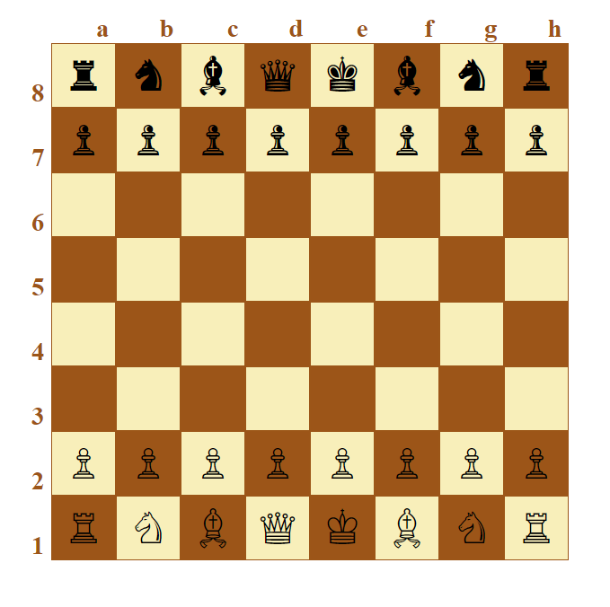

# chessboard

## chessboard is HTML/CSS training project where different approaches used to create same looking chessboards 
 

- Each html file contains different mark up, approach reflected in files' names e.g. `chessboard-div.html` means that mark up built on `
` elements
 

- One `css` file is used to style all three `html` files, FlexBox used for layout wherever possible (exception is chessboard built with `<table></table>`)

